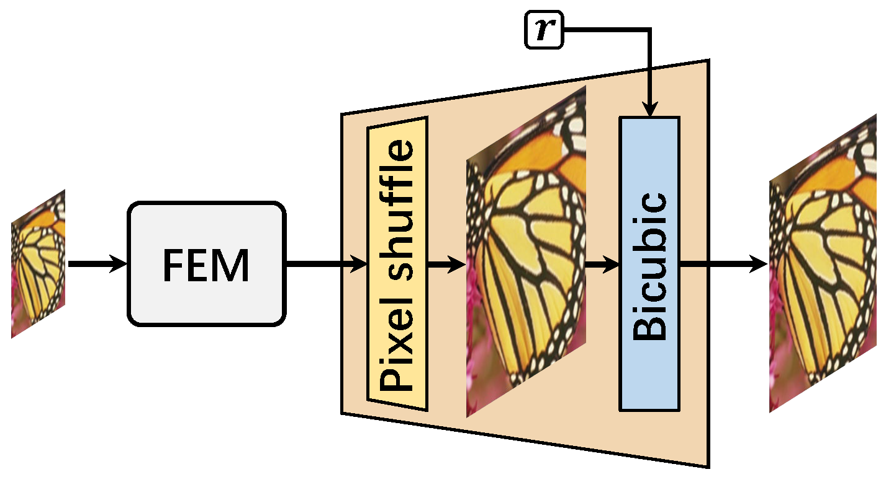
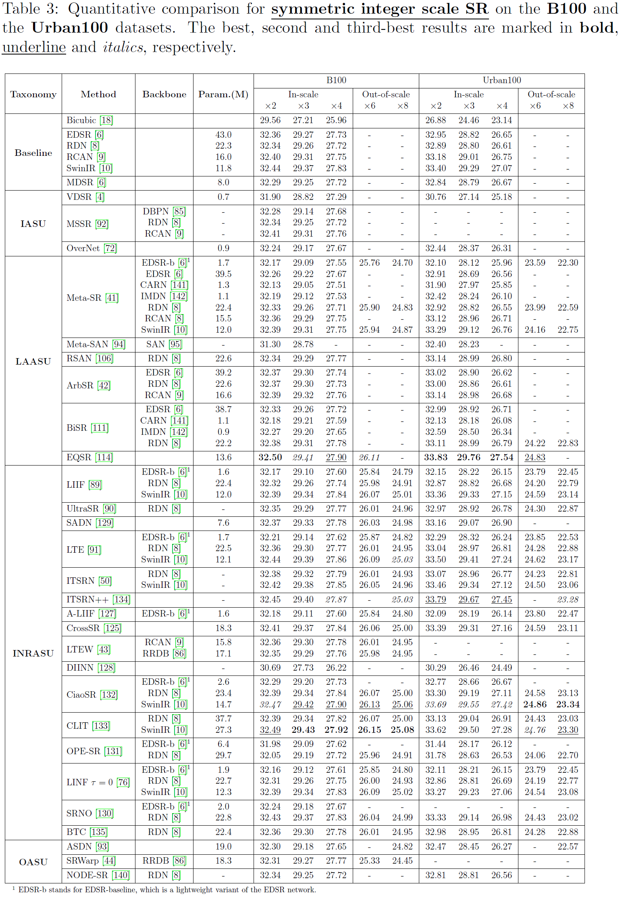

# This repo is built for survey paper: Arbitrary-Scale Super-Resolution via Deep Learning: A Comprehensive Survey

Arbitrary-scale image super-resolution (ISR) and video super-resolution (VSR) methods

## Update

- 2023.09.28: add 1 new methods ([McASSR](https://openaccess.thecvf.com/content/ICCV2023/html/Li_Rethinking_Multi-Contrast_MRI_Super-Resolution_Rectangle-Window_Cross-Attention_Transformer_and_Arbitrary-Scale_Upsampling_ICCV_2023_paper.html)) in taxonomy INRASU. 
- 2023.09.08: add 2 new methods ([DIIF](https://arxiv.org/abs/2306.12321), [SVAE-SR](https://arxiv.org/abs/2307.09008)) in taxonomy INRASU. 
- **2023.09.14: Our paper "*Arbitrary-Scale Super-Resolution via Deep Learning: A Comprehensive Survey*" is accepted by Information Fusion.** 

## Taxonomy

### 1. Scale-based taxonomy

- The proposed scale-based taxonomy for arbitrary-scale super-resolution. Note that this taxonomy shows representative methods by scales, and some methods can achieve super-resolution scales that are not limited to their taxonomic scale. For instance, ArbSR can also achieve symmetric scales, and LTEW can achieve both asymmetric and symmetric scales. 

###  2. Upsampling-based taxonomy

- The proposed upsampling-based taxonomy for recent arbitrary-scale super-resolution methods. 

- Timeline of the development of deep learning-based arbitrary-scale super-resolution methods. 

#### 2.1 Interpolation Arbitrary-Scale Upsampling (IASU)

- Implementation based on arbitrary-scale interpolation. The " $r$ " represents an arbitrary upscaling scale. The “FEM” stands for feature extraction module.

    

    

| Paper                                                        | Model   | Code                                                         | Published                                                    |
| ------------------------------------------------------------ | ------- | ------------------------------------------------------------ | ------------------------------------------------------------ |
| Accurate Image Super-Resolution Using Very Deep Convolutional Networks | VDSR    | [MATLAB](https://cv.snu.ac.kr/research/VDSR/VDSR_code.zip), [PyTorch](https://github.com/Lornatang/VDSR-PyTorch) | [CVPR'2016](https://openaccess.thecvf.com/content_cvpr_2016/html/Kim_Accurate_Image_Super-Resolution_CVPR_2016_paper.html), [arXiv'2015](https://arxiv.org/abs/1511.04587) |
| Single Image Super-Resolution: From Discrete to Continuous Scale Without Retraining | MSSR    | -                                                            | [ACCESS'2020](https://ieeexplore.ieee.org/document/8993794)  |
| A Unified Network for Arbitrary Scale Super-Resolution of Video Satellite Images | ASSR    | -                                                            | [TGRS'2020](https://ieeexplore.ieee.org/document/9277650)    |
| OverNet: Lightweight Multi-Scale Super-Resolution with Overscaling Network | OverNet | [PyTorch](https://github.com/pbehjatii/OverNet-PyTorch)      | [WACV'2021](https://openaccess.thecvf.com/content/WACV2021/html/Behjati_OverNet_Lightweight_Multi-Scale_Super-Resolution_With_Overscaling_Network_WACV_2021_paper.html) |

#### 2.2 Learnable Adaptive Arbitrary-Scale Upsampling (LAASU)

##### 2.2.1 Meta Upsampling

- Framework of the Meta-SR. 

| Paper                                                        | Model      | Code                                                   | Published                                                    |
| ------------------------------------------------------------ | ---------- | ------------------------------------------------------ | ------------------------------------------------------------ |
| Meta-SR: A Magnification-Arbitrary Network for Super-Resolution | Meta-SR    | [PyTorch](https://github.com/XuecaiHu/Meta-SR-Pytorch) | [CVPR'2019](https://openaccess.thecvf.com/content_CVPR_2019/html/Hu_Meta-SR_A_Magnification-Arbitrary_Network_for_Super-Resolution_CVPR_2019_paper.html) |
| Arbitrary Scale Super-Resolution for Brain MRI Images        | Meta-SRGAN | -                                                      | [AIAI'2020](https://link.springer.com/chapter/10.1007/978-3-030-49161-1_15) |
| MIASSR: An Approach for Medical Image Arbitrary Scale Super-Resolution | MIASSR     | [PyTorch](https://github.com/GinZhu/MIASSR)            | [arXiv'2021](https://arxiv.org/abs/2105.10738)               |
| Second-Order Attention Network for Magnification-Arbitrary Single Image Super-Resolution | Meta-SAN   | -                                                      | [ICDH'2020](https://ieeexplore.ieee.org/document/9457288)    |
| Meta-USR: A Unified Super-Resolution Network for Multiple Degradation Parameters | Meta-USR   | -                                                      | [TNNLS'2020](https://ieeexplore.ieee.org/document/9180081)   |
| Residual scale attention network for arbitrary scale image super-resolution | RSAN       | -                                                      | [NEUCOM'2021](https://www.sciencedirect.com/science/article/pii/S0925231220317872) |

##### 2.2.2 Adaptive Upsampling

- An overview of ArbSR. 

| Paper                                                        | Model      | Code                                                         | Published                                                    |
| ------------------------------------------------------------ | ---------- | ------------------------------------------------------------ | ------------------------------------------------------------ |
| Learning A Single Network for Scale-Arbitrary Super-Resolution | ArbSR      | [PyTorch](https://github.com/The-Learning-And-Vision-Atelier-LAVA/ArbSR) | [ICCV'2021](https://openaccess.thecvf.com/content/ICCV2021/html/Wang_Learning_a_Single_Network_for_Scale-Arbitrary_Super-Resolution_ICCV_2021_paper.html) |
| Bilateral Upsampling Network for Single Image Super-Resolution With Arbitrary Scaling Factors | BiSR       | [PyTorch](https://github.com/Merle314/BiSR)                  | [TIP'2021](https://ieeexplore.ieee.org/document/9403904)     |
| Learning for Unconstrained Space-Time Video Super-Resolution | USTVSRNet  | -                                                            | [TBC'2021](https://ieeexplore.ieee.org/abstract/document/9642062?casa_token=Xc0ornusEJYAAAAA:-9lUkxtsWLp572qrXXhZuubxOZaMbYSEevQ7DG3npL_54vRycWoybF8IiOstnEJpWs2xsCxtChUC) |
| Scale-arbitrary Invertible Image Downscaling                 | AIDN       | -                                                            | [arXiv'2022](https://arxiv.org/abs/2201.12576)               |
| FaceFormer: Scale-aware Blind Face Restoration with Transformers | FaceFormer | -                                                            | [arXiv'2022](https://arxiv.org/abs/2207.09790)               |
| Deep Arbitrary-Scale Image Super-Resolution via Scale-Equivariance Pursuit | EQSR       | [PyTorch](https://github.com/neuralchen/EQSR)                | [CVPR'2023](https://openaccess.thecvf.com/content/CVPR2023/html/Wang_Deep_Arbitrary-Scale_Image_Super-Resolution_via_Scale-Equivariance_Pursuit_CVPR_2023_paper.html) |

#### 2.3 Implicit Neural Representation based Arbitrary-Scale Upsampling (INRASU)

- The overall network structure of LIIF. 

| Paper                                                        | Model | Code                                      | Published                                                    |
| ------------------------------------------------------------ | ----- | ----------------------------------------- | ------------------------------------------------------------ |
| Learning Continuous Image Representation with Local Implicit Image Function | LIIF  | [PyTorch](https://github.com/yinboc/liif) | [CVPR'2021](https://openaccess.thecvf.com/content/CVPR2021/html/Chen_Learning_Continuous_Image_Representation_With_Local_Implicit_Image_Function_CVPR_2021_paper.html) |

| Paper                                                        | Model    | Code                                                         | Published                                                    |
| ------------------------------------------------------------ | -------- | ------------------------------------------------------------ | ------------------------------------------------------------ |
| **Spectral bias**                                            |          |                                                              |                                                              |
| UltraSR: Spatial Encoding is a Missing Key for Implicit Image Function-based Arbitrary-Scale Super-Resolution | UltraSR  | [PyTorch](https://github.com/SHI-Labs/UltraSR-Arbitrary-Scale-Super-Resolution) (only repo, no code) | [arXiv'2021](https://arxiv.org/abs/2103.12716)               |
| Enhancing Multi-Scale Implicit Learning in Image Super-Resolution with Integrated Positional Encoding | IPE-LIIF | -                                                            | [arXiv'2021](https://arxiv.org/abs/2112.05756)               |
| Cross Transformer Network for Scale-Arbitrary Image Super-Resolution | CrossSR  | -                                                            | [KSEM'2022](https://link.springer.com/chapter/10.1007/978-3-031-10986-7_51) |
| Local Texture Estimator for Implicit Representation Function | LTE      | [PyTorch](https://github.com/jaewon-lee-b/lte)               | [CVPR'2022](https://openaccess.thecvf.com/content/CVPR2022/html/Lee_Local_Texture_Estimator_for_Implicit_Representation_Function_CVPR_2022_paper.html) |
| Adaptive Local Implicit Image Function for Arbitrary-Scale Super-Resolution | A-LIIF   | [PyTorch](https://github.com/LeeHW-THU/A-LIIF)               | [ICIP'2022](https://ieeexplore.ieee.org/abstract/document/9897382?casa_token=4rBANHJDzLIAAAAA:MTnBmKowgdwWVtQ_GfomYySlnVRLHL8mkgn8M7fVs5rpRENAIbkZ_QeWt7Q32aUaS1EysxUcjsMb) |
| Single Image Super-Resolution via a Dual Interactive Implicit Neural Network | DIINN    | [PyTorch](https://github.com/robotic-vision-lab/dual-interactive-implicit-neural-network) | [WACV'2023](https://openaccess.thecvf.com/content/WACV2023/html/Nguyen_Single_Image_Super-Resolution_via_a_Dual_Interactive_Implicit_Neural_Network_WACV_2023_paper.html) |
| Recovering Realistic Details for Magnification-Arbitrary Image Super-Resolution | IPF      | -                                                            | [TIP'2022](https://ieeexplore.ieee.org/abstract/document/9776607?casa_token=701KLDfRmYIAAAAA:PkU8lSxPYCrgAeoa1jDu7PwVBAb9P81IL6xGEEQfF1YNIFtmdJJQ4q9sxMc_1-Q7_OXhiNEbnn5v) |
| Photo-Realistic Continuous Image Super-Resolution with Implicit Neural Networks and Generative Adversarial Networks | CiSR-GAN | -                                                            | [NLDL'2022](https://septentrio.uit.no/index.php/nldl/article/view/6285) |
| Scale-Aware Dynamic Network for Continuous-Scale Super-Resolution (arXiv) Learning Dynamic Scale Awareness and Global Implicit Functions for Continuous-Scale Super-Resolution of Remote Sensing Images (TGRS) | SADN     | [PyTorch](https://github.com/hanlinwu/SADN)                  | [arXiv'2021](https://arxiv.org/abs/2110.15655), [TGRS'2023](https://ieeexplore.ieee.org/abstract/document/10026827) |
| Local Implicit Normalizing Flow for Arbitrary-Scale Image Super-Resolution | LINF     | [PyTorch](https://github.com/JNNNNYao/LINF)                  | [CVPR'2023](https://openaccess.thecvf.com/content/CVPR2023/html/Yao_Local_Implicit_Normalizing_Flow_for_Arbitrary-Scale_Image_Super-Resolution_CVPR_2023_paper.html) |
| Implicit Diffusion Models for Continuous Super-Resolution    | IDM      | [PyTorch](https://github.com/Ree1s/IDM)                      | [CVPR'2023](https://openaccess.thecvf.com/content/CVPR2023/html/Gao_Implicit_Diffusion_Models_for_Continuous_Super-Resolution_CVPR_2023_paper.html) |
| Super-Resolution Neural Operator                             | SRNO     | [PyTorch](https://github.com/2y7c3/Super-Resolution-Neural-Operator) | [CVPR'2023](https://openaccess.thecvf.com/content/CVPR2023/html/Wei_Super-Resolution_Neural_Operator_CVPR_2023_paper.html) |
| **Flipping consistency decline**                             |          |                                                              |                                                              |
| OPE-SR: Orthogonal Position Encoding for Designing a Parameter-Free Upsampling Module in Arbitrary-Scale Image Super-Resolution | OPE-SR   | [PyTorch](https://github.com/gaochao-s/ope-sr)               | [CVPR'2023](https://openaccess.thecvf.com/content/CVPR2023/html/Song_OPE-SR_Orthogonal_Position_Encoding_for_Designing_a_Parameter-Free_Upsampling_Module_CVPR_2023_paper.html) |
| **Local ensemble**                                           |          |                                                              |                                                              |
| Cascaded Local Implicit Transformer for Arbitrary-Scale Super-Resolution | CLIT     | [PyTorch](https://github.com/jaroslaw1007/CLIT)              | [CVPR'2023](https://openaccess.thecvf.com/content/CVPR2023/html/Chen_Cascaded_Local_Implicit_Transformer_for_Arbitrary-Scale_Super-Resolution_CVPR_2023_paper.html) |
| CiaoSR: Continuous Implicit Attention-in-Attention Network for Arbitrary-Scale Image Super-Resolution | CiaoSR   | [PyTorch](https://github.com/caojiezhang/CiaoSR)             | [CVPR'2023](https://openaccess.thecvf.com/content/CVPR2023/html/Cao_CiaoSR_Continuous_Implicit_Attention-in-Attention_Network_for_Arbitrary-Scale_Image_Super-Resolution_CVPR_2023_paper.html) |
| **Others**                                                   |          |                                                              |                                                              |
| Implicit Transformer Network for Screen Content Image Continuous Super-Resolution | ITSRN    | [PyTorch](https://github.com/codyshen0000/ITSRN)             | [NeurIPS'2021](https://proceedings.neurips.cc/paper/2021/hash/6e7d5d259be7bf56ed79029c4e621f44-Abstract.html) |
| ITSRN++: Stronger and Better Implicit Transformer Network for Continuous Screen Content Image Super-Resolution | ITSRN++  | -                                                            | [arXiv'2022](https://arxiv.org/abs/2210.08812)               |
| B-Spline Texture Coefficients Estimator for Screen Content Image Super-Resolution | BTC      | [PyTorch](https://github.com/ByeongHyunPak/btc)              | [CVPR'2023](https://openaccess.thecvf.com/content/CVPR2023/html/Pak_B-Spline_Texture_Coefficients_Estimator_for_Screen_Content_Image_Super-Resolution_CVPR_2023_paper.html) |
| Learning Local Implicit Fourier Representation for Image Warping | LTEW     | [PyTorch](https://github.com/jaewon-lee-b/ltew)              | [ECCV'2022](https://link.springer.com/chapter/10.1007/978-3-031-19797-0_11) |
| Towards Bidirectional Arbitrary Image Rescaling: Joint Optimization and Cycle Idempotence | BAIRNet  | -                                                            | [CVPR'2022](https://openaccess.thecvf.com/content/CVPR2022/html/Pan_Towards_Bidirectional_Arbitrary_Image_Rescaling_Joint_Optimization_and_Cycle_Idempotence_CVPR_2022_paper.html) |
| VideoINR: Learning Video Implicit Neural Representation for Continuous Space-Time Super-Resolution | VideoINR | [PyTorch](https://github.com/Picsart-AI-Research/VideoINR-Continuous-Space-Time-Super-Resolution) | [CVPR'2022](https://openaccess.thecvf.com/content/CVPR2022/html/Chen_VideoINR_Learning_Video_Implicit_Neural_Representation_for_Continuous_Space-Time_Super-Resolution_CVPR_2022_paper.html) |
| Learning Spatial-Temporal Implicit Neural Representations for Event-Guided Video Super-Resolution | EGVSR    | [PyTorch](https://github.com/yunfanLu/INR-Event-VSR)         | [CVPR'2023](https://openaccess.thecvf.com/content/CVPR2023/html/Lu_Learning_Spatial-Temporal_Implicit_Neural_Representations_for_Event-Guided_Video_Super-Resolution_CVPR_2023_paper.html) |
| An Arbitrary Scale Super-Resolution Approach for 3-Dimensional Magnetic Resonance Image using Implicit Neural Representation | ArSSR    | [PyTorch](https://github.com/iwuqing/ArSSR)                  | [JBHI'2022](https://ieeexplore.ieee.org/document/9954892)    |
| Learning Continuous Representation of Audio for Arbitrary Scale Super Resolution | LISA     | -                                                            | [ICASSP'2022](https://ieeexplore.ieee.org/document/9746083)  |
| **Update** (Note: the following methods published after our survey, they are not introduced in the survey) |          |                                                              |                                                              |
| Dynamic Implicit Image Function for Efficient Arbitrary-Scale Image Representation | DIIF     | [Code](https://github.com/HeZongyao/DIIF) (only repo, no code) | [arXiv'2023](https://arxiv.org/abs/2306.12321)               |
| Soft-IntroVAE for Continuous Latent space Image Super-Resolution | SVAE-SR  | -                                                            | [arXiv'2023](https://arxiv.org/abs/2307.09008)               |
| Rethinking Multi-Contrast MRI Super-Resolution: Rectangle-Window Cross-Attention Transformer and Arbitrary-Scale Upsampling | McASSR   | [PyTorch](https://github.com/GuangYuanKK/McMRSR)             | [ICCV'2023](https://openaccess.thecvf.com/content/ICCV2023/html/Li_Rethinking_Multi-Contrast_MRI_Super-Resolution_Rectangle-Window_Cross-Attention_Transformer_and_Arbitrary-Scale_Upsampling_ICCV_2023_paper.html) |

#### 2.4 Other Arbitrary Scale Upsampling (OASU)

| Paper                                                        | Model   | Code                                                         | Published                                                    |
| ------------------------------------------------------------ | ------- | ------------------------------------------------------------ | ------------------------------------------------------------ |
| ASDN: A Deep Convolutional Network for Arbitrary Scale Image Super-Resolution | ASDN    | [PyTorch](https://github.com/alessandrodicosola/SuperSampling) | [MNA'2021](https://link.springer.com/article/10.1007/s11036-020-01720-2) |
| SRWarp: Generalized Image Super-Resolution under Arbitrary Transformation | SRWarp  | [PyTorch](https://github.com/sanghyun-son/srwarp)            | [CVPR'2021](https://openaccess.thecvf.com/content/CVPR2021/html/Son_SRWarp_Generalized_Image_Super-Resolution_under_Arbitrary_Transformation_CVPR_2021_paper.html) |
| Single Image Super-Resolution with Arbitrary Magnification Based on High-Frequency Attention Network | H2A2-SR | -                                                            | [MATH'2022](https://www.mdpi.com/2227-7390/10/2/275)         |
| Progressive Image Super-Resolution via Neural Differential Equation | NODE-SR | -                                                            | [ICASSP'2022](https://ieeexplore.ieee.org/document/9747645)  |

# Performance Comparison

### 1. Quantitative Comparison

- The PSNR results in the cases of $\times 4$ and $\times 2.5$ scales and the number of parameters for arbitrary-scale super-resolution methods on the B100 dataset. The name in the brackets denotes the backbone of the implementation. The horizontal axis and the vertical axis denote the PSNR results in the case of non-integer scale $\times 2.5$ and integer scale $\times 4$, respectively, and the circle size represents the number of parameters.

### 2. Qualitative Comparison

- Visual comparison for symmetric integer scale SR on benchmark datasets. Moreover, we also report the PSNR and SSIM results for each method.

- Visual comparison for symmetric non-integer scale SR on the B100 dataset. Moreover, we also report the PSNR and SSIM results for each method.

